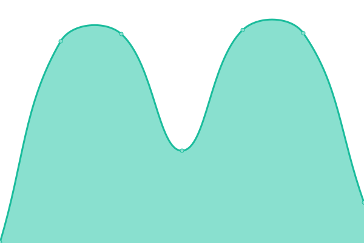
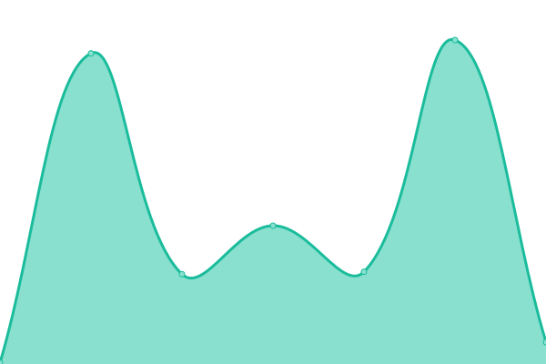
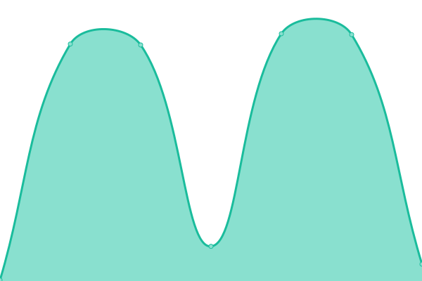

# [📈 Live Status](https://chashguru.github.io/monitoring): <!--live status--> **🟧 Partial outage**

This repository contains the open-source uptime monitor and status page for [Yogesh Kumar](https://chashguru.github.io/monitoring), powered by [Upptime](https://github.com/upptime/upptime).

With [Upptime](https://upptime.js.org), you can get your own unlimited and free uptime monitor and status page, powered entirely by a GitHub repository. We use [Issues](https://github.com/chashguru/monitoring/issues) as incident reports, [Actions](https://github.com/chashguru/monitoring/actions) as uptime monitors, and [Pages](https://chashguru.github.io/monitoring) for the status page.

<!--start: status pages-->
<!-- This summary is generated by Upptime (https://github.com/upptime/upptime) -->
<!-- Do not edit this manually, your changes will be overwritten -->
<!-- prettier-ignore -->
| URL | Status | History | Response Time | Uptime |
| --- | ------ | ------- | ------------- | ------ |
|  [Facebook App](https://dash11.comm100.io/api/facebookapp/health) | 🟩 Up | [facebook-app.yml](https://github.com/chashguru/monitoring/commits/HEAD/history/facebook-app.yml) | 

 526ms
     
 | 

<a href="https://chashguru.github.io/monitoring/history/facebook-app">100.00%</a>
    

|  [WhatsApp Cloud](https://dash11.comm100.io/api/whatsappcloud/health) | 🟩 Up | [whats-app-cloud.yml](https://github.com/chashguru/monitoring/commits/HEAD/history/whats-app-cloud.yml) | 

 176ms
     
 | 

<a href="https://chashguru.github.io/monitoring/history/whats-app-cloud">100.00%</a>
    

|  [Ticketing](https://dash11.comm100.io/api/ticketing/health) | 🟩 Up | [ticketing.yml](https://github.com/chashguru/monitoring/commits/HEAD/history/ticketing.yml) | 

 154ms
     
 | 

<a href="https://chashguru.github.io/monitoring/history/ticketing">100.00%</a>
    

|  [Telnyx](https://dash11.comm100.io/api/telnyxsmsadapter/health) | 🟩 Up | [telnyx.yml](https://github.com/chashguru/monitoring/commits/HEAD/history/telnyx.yml) | 

 157ms
     
 | 

<a href="https://chashguru.github.io/monitoring/history/telnyx">100.00%</a>
    

|  [Contact SSO](https://dash11.comm100.io/api/contactsso/health) | 🟩 Up | [contact-sso.yml](https://github.com/chashguru/monitoring/commits/HEAD/history/contact-sso.yml) | 

 149ms
     
 | 

<a href="https://chashguru.github.io/monitoring/history/contact-sso">100.00%</a>
    

|  [Deltapath](https://dash11.comm100.io/api/deltapath/health) | 🟩 Up | [deltapath.yml](https://github.com/chashguru/monitoring/commits/HEAD/history/deltapath.yml) | 

 151ms
     
 | 

<a href="https://chashguru.github.io/monitoring/history/deltapath">100.00%</a>
    

|  [Messenger](https://dash11.comm100.io/api/messenger/health) | 🟩 Up | [messenger.yml](https://github.com/chashguru/monitoring/commits/HEAD/history/messenger.yml) | 

 176ms
     
 | 

<a href="https://chashguru.github.io/monitoring/history/messenger">100.00%</a>
    

|  [ACPNS](https://dash11.comm100.io/api/acpns/health) | 🟥 Down | [acpns.yml](https://github.com/chashguru/monitoring/commits/HEAD/history/acpns.yml) | 

 15169ms
     
 | 

<a href="https://chashguru.github.io/monitoring/history/acpns">100.00%</a>
    

|  [Email App](https://dash11.comm100.io/api/emailapp/health) | 🟥 Down | [email-app.yml](https://github.com/chashguru/monitoring/commits/HEAD/history/email-app.yml) | 

 15153ms
     
 | 

<a href="https://chashguru.github.io/monitoring/history/email-app">100.00%</a>
    

|  [Secure Messaging](https://dash11.comm100.io/api/securemessaging/health) | 🟥 Down | [secure-messaging.yml](https://github.com/chashguru/monitoring/commits/HEAD/history/secure-messaging.yml) | 

 15162ms
     
 | 

<a href="https://chashguru.github.io/monitoring/history/secure-messaging">0.00%</a>
    

<!--end: status pages-->

[**Visit our status website →**](https://chashguru.github.io/monitoring)

## 📄 License

- Powered by: [Upptime](https://github.com/upptime/upptime)
- Code: [MIT](./LICENSE) © [Yogesh Kumar](https://chashguru.github.io/monitoring)
- Data in the `./history` directory: [Open Database License](https://opendatacommons.org/licenses/odbl/1-0/)
